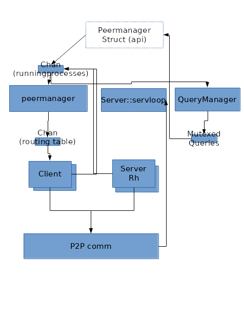

# MyDHT Refactoring And Threading (part 1)

Lastly I got some time in my hand (ended my previous job and looking for more low level programming) to refactor some pretty terrible old project of mine.

Even if the refactor is far from complete, the design and its primo implementation is.

This post focus on [MyDHT](https://www.github.com/cheme/mydht) redesign,

# Previous design

The initial purpose of MyDHT project was to design a library to run a distributed hash table. It evolves to key value peer to peer info exchange with multi-hop request proxying (query proxyied to none connected peers).
Before redesign, it finally was a HashTable only if using a right Routing implementation (eg mydht-btkad (currently broken)).  
Final goal was at the time to implement web of trust application upon this technical brick (some testing with broken mydht-wot).  


At the time I was less aware of asynch transport and used only standard rust api (blocking transport) :
- a transport trait based upon rust tcp synch api, but with some very odd design. The odd design let me run it on udp with dirty tricks (reader containing the udp frame and read thread running from start on every one). I also give some attempt to use mio (asynch transport) but using it under this design had very few advantages and I dropped it when the coroutine crate I used at the time becames deprecated.
So we got a read stream and a write stream : we allow unidirectionnal transport with one socket sending to dest peer and one other socket receiving from dest peer, but we also allow using the same socket depending on transport implementation (internally both read and write stream can use the same tcp socket and be spawn at the same time in transport)
- a peer abstraction (related to transport listening address obviously)
- a keyval abstraction for content to be share (peer being obviously a keyval)
- the encoding/decoding of Key Value was using Rust standard serialize abstraction which I switch to serde with my refacto. It allows many type of exchanges (actually test case runs only over json and binary (bincode crate)).
- authentication scheme was broken (udp implementation was allowed by it) : with only two messages called ping and pong leading to a potential dos replay attack, new scheme run with ping - pong - pong (three message).
- rules were overly complicated and ill designed (it stay true but limited to kvstore service now)
- some shadowing mechanism where implemented (refacto was done to use my 'readwrite-comp' lib which was totally inspired by this) allowing some forms of encryption over transport.
- keyval and peer storage trait with cache trait and query cache trait, quite a mess by looking back, still have to redesign that
- Route trait to decide which peers to query, same still need some redesign

The schema bellow gives an idea of the running threads :



Missing from schema are a few single thread like Key/Value storage, or Peer storage (in routing table), honestly I do not quite get this schema anymore, main things of interest are:

Communication between thread used standard Mpsc, with Arc over peer and KeyVal. The senders channel were group in a 'RunningProcess' clonable struct  : that was pretty flexible and basically every thread could send message to any thread, except the read and write threads as destination. Read thread was driven by transport and write message proxied by peer management thread to write thread.

All thread where implemented as a single static function call (with a lot of parameter and generic type (generic type were grouped in a few single generic traits by using associated trait but it still looks prety bad)).

Quickly opening unconditionnaly so many system thread felt as bad design and I put some dirty 'ClientMode' and 'ServerMode' enum (and their associated handle) to allow running read and write process in a new thread or in a batch of existing threads or as a local function call in the parent thread.  
Client and Server function call became fastly unintelligible, and it requires to change of 'Transport' trait by introducing a circumvoluted 'start' function using a closure over the server (read) thread called on reception of a new connection.  
https://github.com/cheme/mydht/blob/8d2ff89d48ea9ef993524aabed7b666ba91f8160/src/procs/server.rs line 160 to 220 is a good illustration of this point.


# New design

Being totaly annoyed by threads everywhere (it is a library and I do not want to make those choice definitive), ClientMode and ServerMode were added. Looking back at it, it is close to unmaintanable and only implemented for Server (read stream) and Client (write stream) process.

This was one of my concerns while getting back at mydht, with a few simple goals :
 - usage of future lib to simplify the thread model
 - actual usage of asynch transport
 - dependencies upgrade : serde usage being the most obvious, new version of openssl (nice change in api but impacting)...

Investigating the 'future' crate and tokio ecosystem, I almost go that way but some of my plan at the time did not match (looking back at my final service abstraction it should have match except for a few details), especially the idea that I wanted a more stream oriented transport trait (I want to plug my 'tunnel' lib other the transport but by using MyDHT internal peer management).  
I also had quite some fun using Mio (epoll for rust lib) directly and really liked the changes made to the api from the last time I tested it, and decide to run bare mio (no abstraction as I thought it would be a quick job) with very basic state and service (ideally service should simplify and replace what was run with 'ClientHandle' and 'ServerHandle' before).

So started with transport trait redesign, I quickly felt as uneasy as before : I should use an Arc here, this should run in another thread but not in all case... And I use a 'Service' thread which was inspired by tokio service design and a suspend/yield mechanism inconsciously inspired by some of the future concept (especially the fact that when experimenting with future I add to unpark future thread at some point keep a thread handle).

The point at first was to stop running those previous procs functions.
Next it quickly lead to a service based approach (model has change quite a bit from the start but seems ok now (except the dissiciation of channel and service leading to very verbose things)). At end, it look similar to what remember of erlang OTP.

## Service traits


  * Service

```rust
pub trait Service {
  type CommandIn;
  type CommandOut;
  fn call<S : SpawnerYield>(&mut self, req: Self::CommandIn, async_yield : &mut S) -> Result<Self::CommandOut>;
}
```
  CommandIn and CommadOut are receive from or send into channels.

  * Spawner

```rust
pub trait Spawner<
  S : Service,
  D : SpawnSend<<S as Service>::CommandOut>,
  R : SpawnRecv<<S as Service>::CommandIn>> {
  type Handle : SpawnHandle<S,D,R>;
  type Yield : SpawnerYield;
  fn spawn (
    &mut self,
    service : S,
    spawn_out : D,
    Option<<S as Service>::CommandIn>,
    rec : R,
    nb_loop : usize // infinite if 0
  ) -> Result<Self::Handle>;
}
```
Basically a way to call a service for a certain number of iteration, each iteration being the reception of a command from input channel the service call and the sending of the service result in the output channel.

  * Channel

```rust
pub trait SpawnChannel<Command> {
  type WeakSend : SpawnSend<Command> + Clone;
  type Send : SpawnSend<Command> + Clone;
  type Recv : SpawnRecv<Command>;
  fn new(&mut self) -> Result<(Self::Send,Self::Recv)>;
  fn get_weak_send(&Self::Send) -> Option<Self::WeakSend>;
}
```
with spawn send and spawn receive similar to an mpsc channel (a const boolean indicate if a channel can send but I should remove it).
```rust
pub trait SpawnSend<Command> : Sized {
  const CAN_SEND : bool;
  fn send(&mut self, Command) -> Result<()>;
}
pub trait SpawnRecv<Command> : Sized {
  fn recv(&mut self) -> Result<Option<Command>>;
}
```

  * Yield

Yield is the spawn associatied type that is called when getting a new message from the input channel if empty, but can also be directly call from service.
```rust
pub trait SpawnerYield {
  fn spawn_yield(&mut self) -> YieldReturn;
}
```
An example of direct call from service is when Read transport stream being asynch return a WouldBlock error : then we suspend.

Suspend can result in two behavior :

- YieldReturn::Return : the state is stored in service and we exit from execution (will be restore later from handle)
- YieldReturn::Loop : the Yield and spawn lead to a context switch and Unyield will pursue exection at this point so in this case we only need to redo the command which leads to suspend.


  * Handle

  Yes it feels bad, I wanted to get rid of those Client and Server Handle and have associated Service Handle now... At least this is reusable and not as specific to a context as before.

```rust
pub trait SpawnHandle<Service,Sen,Recv> : SpawnUnyield {
  type WeakHandle : SpawnUnyield + Clone;

  fn unwrap_state(self) -> Result<(Service,Sen,Recv,Result<()>)>;
  fn get_weak_handle(&self) -> Option<Self::WeakHandle>;
}
```
The handle let us get the service state (when service is finished) to restart service or manage unprocessed command.
A weak handle allows sharing a bit of this handle but is not mandatory (use 'NoHandle' as associated type and return None if such an implementation is impossible or bad).
The handle is also 'SpawnUnyield' letting us unyield suspend service and also check if service is still running.
```rust
pub trait SpawnUnyield {
  fn is_finished(&mut self) -> bool;
  fn unyield(&mut self) -> Result<()>;
}

```
  * Synch object

  In my previous implementation, having spend sometime doing few haskell, I tend to confuse a reference with an immutable object and force the Sync trait at many place (on peer and keyval at least) by considering those value to be read only (they are and a change in Peer address should be propagated to all process (currently it looks more robust on this point)), but that is kinda wrong.

  Switching reference was also needed, with a local spawner (when we spawn without new thread) we do not require KeyVal or Peer to be 'Send' and 'Arc' default usage was useless : we defines Ref<P> and SRef traits.

```rust
pub trait Ref<T> : SRef + Borrow<T> {
  fn new(t : T) -> Self;
}
```

Those Ref will mainly be Arc ('ArcRef') when running other multiple thread and Rc ('RcRef') with copy in between thread when running with less threaded configs or small contents (for such 'CloneRef' can be use).

Currently it is only applied to the very central Peer object (not KeyVal directly as we do not have a central KeyVal concept but a global service implementation which can run a KeyVal exchange).

```rust
pub trait SRef : Sized {
  type Send : SToRef<Self>;
  fn get_sendable(self) -> Self::Send;
}
pub trait SToRef<T : SRef> : Send + Sized {
  fn to_ref(self) -> T;
}
```
Basically SRef is similar to Into<Send> but with a single associated type and a way back.


## Consequence on design

  This service abstraction makes it even clearer that MyDHT is not a DHT. With previous design we had to create some strange 'key' trait for executing some strange 'store' action in some strange 'keyval storage' (eg old broken mydht-wot web of trust crate) : it was almost obvious that we could replace 'Key' by 'Query' and 'KeyVal' by Reply.
  Therefore this time we do not use an explicit 'keyval' Store but a global service with messages. Code from previous design is ported to the a KVStoreService which when use as GlobalService is almost the same as previous storage of KeyVal. This service implementation is not in an external crates because it is also the default peer storage/exchange implementation.

A simple schema (without Synch transport related trait (may be describe in a future post)) would be :


Every box uses a service with configurable spawner and channels (generally simple input channel and multiplexed output (struct named as 'service' + Dest)).

All messages between service can be route by MainLoop service. MainLoop service contains the peer cache and the Mio Loop for asynch event registration (MainLoop command also registered on it) : MainLoop does not actually suspend and in code we can see that its channels are plugged a bit differently due to its central role (can proxy almost any message).
This central bottleneck can be greatly relieved by establishing other optional channels (combination of weak handle and weak sender), yet this is the core routing (optional channels if closed due to restarted service or no channel/spawner implementation are removed and default routing through mainloop is used).

So those optional HandleSend (depending on spawn and channel choice) allows communicating directly with others service : currently a few are used :
  - api from local and global and peerstore
  - write from read service (corresponding, only when write service is spawn first(the other scenario need to be implemented but it require to change ReadDest content probably by stoping read service and restarting it after))
  - write from local : same as read (readdest is cloned into localdest)
  - global from local

# Conclusion

Another possibility for simplier service traits could be to have a single function for unyielding and sending message : put Channel into SpawnUnyield.

Service definition use too much traits and I need a way to run simple use case (I am thinking macro right now), default associated trait does not fit (need to redefine all if changing one) at the time.

Generaly channels implementations require a limit in their buffers, especially for service such as 'Write' where the message are consumed after authentication but can be send before. That is not an issue as the trait can already return errors.

Next post (part 2) will describe some configuring of those service.

---------------------

# MyDHT service usage switch (part 2)

The point of this post is to give a taste of how service are configured within the [MyDHT](https://www.github.com/cheme/mydht) new design, by adapting a test appli to run in a single thread.

All changes describe are on the trait 'MyDHTConf' implementation for the struct 'TestLocalConf' (to create an application this big trait must be implemented, basically it contains the associated type of every component and the initialisation function for them).

# configuring thread

In a test case, 'test/mainloop.rs' test_connect_all_th, a simple test running a local service proxying the message to the globalservice (useless except for testing) : and a global service implementation with a few touch (ping/pong) command. The message used by this test are simple auth, simple touch service and a simple peer query.

'ThreadPark' spawner is used almost everywhere with an Mpsc channel and using ArcRef over Peer (Arc).

Our new test case 'test_connect_local' will try to run as much as possible over a single thread, though implementing MyDHTConf trait for 'TestLocalConf'.  
So the starting point will be a copy of the full multithreaded one and we will progessivly change it to a single threaded one.

## STRef and usage of non Send reference

First thing no need to use Arc if we run locally, therefore we will use Rc through RcRef (implements SRef and Ref<P>).

```rust
  type PeerRef = RcRef<Self::Peer>;
  //type PeerRef = ArcRef<Self::Peer>;
```

Compiling it will obviously break everywhere : there is no way that our 'MpscChannel' (which is only a wrapper over standard rust mpsc sender and receiver) will run with some Rc<Peer> which is not Send (Send trait is a rust marker for type that could be send to other traits, Rc as a counted reference cannot).

4 nice errors appears all similar to :
```
error[E0277]: the trait bound `std::rc::Rc<mydht_basetest::node::Node>: std::marker::Send` is not satisfied in `procs::server2::ReadService<test::mainloop::TestLocalConf>`
   --> src/test/mainloop.rs:658:6
    |
658 | impl MyDHTConf for TestLocalConf {
    |      ^^^^^^^^^ `std::rc::Rc<mydht_basetest::node::Node>` cannot be sent between threads safely
    |
    = help: within `procs::server2::ReadService<test::mainloop::TestLocalConf>`, the trait `std::marker::Send` is not implemented for `std::rc::Rc<mydht_basetest::node::Node>`
    = note: required because it appears within the type `mydht_base::utils::RcRef<mydht_basetest::node::Node>`
    = note: required because it appears within the type `procs::server2::ReadService<test::mainloop::TestLocalConf>`
    = note: required because of the requirements on the impl of `mydht_base::service::Spawner<procs::server2::ReadService<test::mainloop::TestLocalConf>, procs::server2::ReadDest<test::mainloop::TestLocalConf>, mydht_base::service::DefaultRecv<procs::server2::ReadCommand, std::sync::mpsc::Receiver<procs::server2::ReadCommand>>>` for `mydht_base::service::ThreadPark`
```

At this point we could change all threaded spawner, but their is the use case where we transmit peers as RcRef or CloneRef (for instance if peers is a single ip address) and still use threading. 

So the solution will be copying the Rc to the new thread, that is what SRef implemnetation of RcRef does : give a sendable type for Rc<Peer> (simply cloning Peer) and then in the spawn thread put back this to a RcRef (putting it back may not be suitable but RcRef<Peer> is the only kind of peer define in the conf and transmit to service commands).
This sending of SRef could not be achieve with MpscChannel but another Channel implementation is doing it (cloning/unwraping on write and putting back to Ref on recv) : 'MpscChannelRef'
```rust
pub struct MpscChannelRef;
pub struct MpscSenderRef<C : SRef>(MpscSender<C::Send>);
pub struct MpscReceiverRef<C : SRef>(MpscReceiver<C::Send>);
pub struct MpscSenderToRef<CS>(MpscSender<CS>);
pub struct MpscReceiverToRef<CS>(MpscReceiver<CS>);
```
It simply wrap an MpscSender of the Send inner typer of our Ref<P> as an SRef, implementation is straightforward.

Changing all our channels (ApiChannelIn, PeerStoreServiceChannelIn, MainLoopChannelIn, MainLoopChannelOut, ReadChannelIn, WriteChannelIn, PeerMgmtChannelIn, GlobalServiceChannelIn) for localproxy we already use a 'NoChannel' as input (received message is build from frame in Read service) and a non threaded spawner : see 'localproxyglobal' macro.
After manually implementing SRef for a lot of Command and Reply struct (a macro is really needed here see for a simple example TODO add link to commit) we still obtain :
```
error[E0277]: the trait bound `std::rc::Rc<mydht_basetest::node::Node>: std::marker::Send` is not satisfied in `procs::server2::ReadService<test::mainloop::TestLocalConf>`
   --> src/test/mainloop.rs:658:6
    |
658 | impl MyDHTConf for TestLocalConf {
    |      ^^^^^^^^^ `std::rc::Rc<mydht_basetest::node::Node>` cannot be sent between threads safely
    |
    = help: within `procs::server2::ReadService<test::mainloop::TestLocalConf>`, the trait `std::marker::Send` is not implemented for `std::rc::Rc<mydht_basetest::node::Node>`
    = note: required because it appears within the type `mydht_base::utils::RcRef<mydht_basetest::node::Node>`
    = note: required because it appears within the type `procs::server2::ReadService<test::mainloop::TestLocalConf>`
    = note: required because of the requirements on the impl of `mydht_base::service::Spawner<procs::server2::ReadService<test::mainloop::TestLocalConf>, procs::server2::ReadDest<test::mainloop::TestLocalConf>, mydht_base::service::DefaultRecv<procs::server2::ReadCommand, mydht_base::service::MpscReceiverRef<procs::server2::ReadCommand>>>` for `mydht_base::service::ThreadPark`
```
Obviously changing the channel was not enough since its type does not match our ThreadPark spawn. Our thread park spawner requires content to be Send, of course our inner mpsc channel uses sendable content.  

Similarily, when spawning a service, a command can be use as first parameter (optional command input in spawn function), letting us run some use case as in 'localproxyglobal' macro where the service is running with a dummy Channel input only using spawn parameter for a single iteration (like a function call). With this usecase service must be restarted at every call with its next command as parameter (handle indicate it is finished and service state is reuse from handle). This usecase also required restart of finished service to be implemented (actually I may have been lazy on many restart it is ok with write service and local service at least).

This is also true for the Service itself, when starting and restarting from finished handle, so SRef must also be implemented for our service, it makes sense as many service use a Ref of current peer and other inner content which could be a SRef.

So the ThreadPark spawn need to use a Send command and similarily to what we did with channel we will use a 'ThreadPark' variant, 'ThreadParkRef' which is going to spawn thread over the associated type of RcRef<P> as an SRef which is Send (P being Mydht Peer, P is Send). Then before looping over the iteration of our service call, our type is wrapped back as an RcRef.

In fact all Send requirement are more or less replaced by SRef (Service, and its receiver and sender), some diffuculties occured with some service members, for instance query cache of kvstore which could not be easily be used as sendable when it contains Rc : in this case it was simply not send in the variant and initiated at service start similarily to kvstore storage (boxed initializer).

Similarily, returning result 'ApiResult' should contain the ArcRef. Another trait implementation will be use to return the SRef::Send : 'ApiResultRef'. The more we go with implementation and the more it looks like SRef usage globally could be a good idea.

At this time we only do it for Ref<Peer> as it is the most commonly use SRef in MyDHT, but custom Global and Local service message are intended to contains such Ref and another Ref should be added in MyDHT. The challenge byte vec for authentication should possibly be SRef (could be a short post idea) because we do not have any idea of the length of the challenge (related to application implementation and undefined at library level).

After changing to ThreadParkRef it compiles and test run. 
As a result, 'test_connect_all_local' is configured to use mainly threads but ran with Rc<Peer> instead of Arc<Peer>, see https://github.com/cheme/mydht/blob/bd098eadba760f2aaa496dfc96f6c3a9e22293de/mydht/src/test/mainloop.rs at line 676

I did cheat a bit on order of errors, first is Spawner then Channel, but it was simplier explaining in this order.

So what did we do ? Just changing MyDHT usage of Arc to use of Rc but staying in a highly multithreaded environment. 

So what's next? Remove those threads as non blocking IO allows it.  


## Removing some threads


Next step will be easiest : changing some services to run in the same thread as the main loop service. Please note that this is only possible if the transport is asynchronous, for synch transport there is a lot of thread restrictions and tricks that I may describe in a future post.

### a statefull service

Api is a single service to store Api queries (query requires a unique id) and return reply in 'ApiReturn' abstraction struct. Currently there is no suitable ApiReturn implementation (an old synch struct is used), others need to be implemented (for C as single blocking function, for Rust as single blocking function, for rust as Future, not ipc as MainLoopChannelOut seems enough for this case...).
Api is a non mandatory service (a MyDHTConf trait boolean associated constant is used to switch result to MainLoopChannelOut if Api Query management is not needed : if the management is done externally and we just simly on the channel (unordered results)), it does not suspend (yield) on anything except its receiving message queue : it is easy to see that suspending is statefull in this case (cache is include in the service struct).

There is the marker trait 'ServiceRestartable' for this kind of service, it means that when Yielding/suspending we can simply end the service and store the state (service struct and current channels) in the handle. When yielding back the handle simply restart the service from its state.

```rust
impl<MC : MyDHTConf,QC : KVCache<ApiQueryId,(MC::ApiReturn,Instant)>> ServiceRestartable for Api<MC,QC> { }
```

It does not mean that we can restart the service after it is finished (all iteration consumed or ended with command).

An example of local spawn implementation with a suspend/restart strategy is 'RestartOrError' :

```rust
impl<S : Service + ServiceRestartable, D : SpawnSend<<S as Service>::CommandOut>, R : SpawnRecv<S::CommandIn>> Spawner<S,D,R> for RestartOrError {
  type Handle = RestartSameThread<S,D,Self,R>;
  type Yield = NoYield;
``` 

Its handle is 'RestartSameThread', an enum containing the handle state (ended or yielded, not a running state as not possible over a single thread wtithout coroutine) and its service state (service struct and its channels plus iteration counter). Interesting point is that it also contains the spawner for restart (in our case our 0 length struct 'RestartOrError').

Its yield is a dummy 'NoYield' simply returning 'YieldReturn::Return' so that the spawner just prepare for return/suspend (fill handle with state) and exit.

So we simply change the following lines :
```rust 
  // type ApiServiceSpawn = ThreadParkRef;
  type ApiServiceSpawn = RestartOrError;
```
and 
```rust 
  fn init_api_spawner(&mut self) -> Result<Self::ApiServiceSpawn> {
    //Ok(ThreadParkRef)
    Ok(RestartOrError)
  }
```
We can see that initialisation is using MyDhtConf as mutable reference, this choice allows more complex spawner usage (for instance if we want to run into a threadpool the initialized pool reference may be include in mydhtconf struct and used), in the examples from this post it will not be used.

Compile and run success, nice.

Still, we did not change the channel, we still use 
```rust
  type ApiServiceChannelIn = MpscChannelRef;
```
Useless, our api service is now on the same thread as main loop. We can send command localy by using LocalRcChannel spawning Rc<RefCell<VecDeque<C>>> channel.
```rust
  //type ApiServiceChannelIn = MpscChannelRef;
  type ApiServiceChannelIn = LocalRcChannel;
```
and 
```rust
  fn init_api_channel_in(&mut self) -> Result<Self::ApiServiceChannelIn> {
//    Ok(MpscChannelRef)
    Ok(LocalRcChannel)
  }
```

In fact an unsafe single value buffer should be fine as currently we unyield on each send of command : this is not mandatory so we would keep it the generic safe VecDeque choice (optimizing this way is still doable but low value in our case). Ideally 'NoChannel' (disabled channel struct) should be use but it requires to change unyield function to allow an optional command (currently this could be good as we systematically unyield on each send).

Those local handle do not have WeakHandle, this illustrate the way message passing will switch : without weak handle the other services (eg 'GlobalDest' containing optional api HandleSend) will send ApiCommand to MainLoop which will proxy it, with a WeakHande like for MpscChannel, the other service can send directly (cf optional weakhandle for spawn handle in previous post).
```rust
pub struct GlobalDest<MC : MyDHTConf> {
  pub mainloop : MainLoopSendIn<MC>,
  pub api : Option<ApiHandleSend<MC>>,
}
```

Thinking back about this conf for api, it looks quite suitable : similar to having the query cache in the mainloop and calling a looping function on it. Probably currently bad for perf (inlining everything is theorically ok as the returning passing of service through the handle seems bad otherwhise yet cache implementation is probably already on heap, same for message waiting in channel). Another thing bad is the use of a channel (a simple vecdeque here) for passing command : to be closest to a function call we can simply use a 'Blocker' spawner with an single iteration limit, but it requires that the code to respawn the service is written (not the case right now for api) : use of 'localproxyglobal' macro in our test is an example.


### a non statefull service

This looks nice for most service but for some service, state could not be restore on unyield. That is the case for read or write service, this is related to the fact that reading is streamed inside of the serializer : we cannot save the state of the serializer/deserializer as its trait does not allow it.
For reference Read service get message with the MsgEnc method :
```rust
  fn decode_msg_from<R : Read>(&self, &mut R) -> MDHTResult<M>;
```
We do not get message directly by reading over an exposed single buffer ('dedocde_msg_from' uses a composition of Reader, notably for shadowing/ciphering of bytes), in this case it would be easy to put the Read stream in a service field and state will be save.
The problem is that our Read stream is a composition of Synch oriented read traits and the lower level transport read is not : therefore when the lower level transport Read return a WouldBlock error (meannig that we should yield) the CompExt should be implemented in a way that reading could restart (doable).
Another bigger issue is that the serializer (generally a serde backend) used for the implementation of MsgEnc would requires to be resumable on a WouldBlock error (not the case at the moment I think or at least for the majority of implementation).

Therefore, the strategy for yielding on Asynch Read/Write is to use a CompExt layer (composition) just over the readstream, the layer will catch WouldBlock Error and Yield on it (no support of statefull suspend with YieldReturn::Return).
CompExt used are 
```rust
pub struct ReadYield<'a,R : 'a + Read,Y : 'a + SpawnerYield> (pub &'a mut R,pub &'a mut Y);
```
and 
```rust
pub struct WriteYield<'a,W : 'a + Write, Y : 'a + SpawnerYield> (pub &'a mut W, pub &'a mut Y);
```
For threaded spawn, like a thread pool or ThreadPark, the thread simply park (block on a condvar) and resume later through its yield handle resume (unlock condvar).
For local spawn, we need to use a CoRoutine : with CoRoutine spawner (using coroutine crate), the coroutine state does include all inner states (even possible Serde backend implementation) and we can suspend at WriteYield/ReadYield level (using YieldReturn::Loop strategie).

Lets adapt write service.
```rust
  //type WriteChannelIn = MpscChannelRef;
  type WriteChannelIn = LocalRcChannel;
  //type WriteSpawn = ThreadParkRef;
  type WriteSpawn = CoRoutine;
```
Note that with a blocking (synch) write stream, write service could suspend (it yields only on the input channel which is done out of service call),  and mydht still run with an impact depending on transport (for many transport is not a major issue if not threaded), for blocking ReadStream suspending only on message input is a huge issue (thread simply block on reading possibly nothing on transport stream).  
Also note that keeping an MpscChannelRef (or a MpscChannel if using ArcRef<Peer>) could still make sense because it will give the possibillity to send message directly to write service through its weak send and handle (but it would require that CoRoutine implement a WeakHandle (which is currently not the case : it would requires to run a shared mutex over the handle and would be a different usecase)).

Another thing is that the number of iteration should be put to unlimited or a higher count to avoid new coroutine on every call.
```rust
  //const SEND_NB_ITER : usize = 1;
  const SEND_NB_ITER : usize = 0; // 0 is unlimited run
```


Doing it for read is way more interesting (infinite service with really recurring suspend on Read transport stream) and run as smouthly :
```rust
  type ReadChannelIn = LocalRcChannel;
  type ReadSpawn = Coroutine;
```

### a blocking service

Already seen before, macro 'localproxyglobal' used in this test is an example of a local service call that does not yield (Blocker spawner), with a single iteration and no channel.
The service is spawn at each time like a function call (optional command is set) and never suspends.
```rust
#[macro_export]
macro_rules! localproxyglobal(() => (
  type GlobalServiceCommand = Self::LocalServiceCommand;
  type GlobalServiceReply  = Self::LocalServiceReply;
  type LocalService = DefLocalService<Self>;
  const LOCAL_SERVICE_NB_ITER : usize = 1;
  type LocalServiceSpawn = Blocker;
  type LocalServiceChannelIn = NoChannel;
  #[inline]
  fn init_local_spawner(&mut self) -> Result<Self::LocalServiceSpawn> {
    Ok(Blocker)
  }
  #[inline]
  fn init_local_channel_in(&mut self) -> Result<Self::LocalServiceChannelIn> {
    Ok(NoChannel)
  }
  #[inline]
  fn init_local_service(me : Self::PeerRef, with : Option<Self::PeerRef>) -> Result<Self::LocalService> {
    Ok(DefLocalService{
      from : me,
      with : with,
    })
  }
));
```

For this kind of configuration, the service must always be call with a command as input, the service must be able to restart when its handle indicates that the service is finished. 

At the time, I've been a bit lazy on writing restart service code, truth is I am not really convinced by its usefulness (the number of iteration criterion is not really good, some time limit may be better). Still, it is done in the hard case, local service spawning from a read service spawning from mainloop service initiated from mydhtconf.


Conclusion
==========

There is still 3 threads (global service, peerstore service and the mainloop), two being the same use case as Api service (single service from mainloop) and the last required to test on multiple peers without having to change the test method.

SRef seems interesting, yet it absolutely requires some macro derivability, it is an ok addition to the 'Send' marker trait.
I consider removing all 'Send' dependant implemention and keeping only the 'SRef' ones : then maybe changing service base type to allways use SRef variants (Send variants becoming useless). Obviously ArcRef and CloneRef SRef implemetation replacing the previous use case (for all thread we only need the config that was describe for running RcRef over threads).  
https://github.com/rust-lang/rust/issues/42763 seems pretty bad with this SRef abstraction, same with almost all spawner, but I think it needs to be checked. 
If putting Service in its own crate, Clone and Send constrained implementation of spawner and channels are still interesting to avoid SRef usage.

