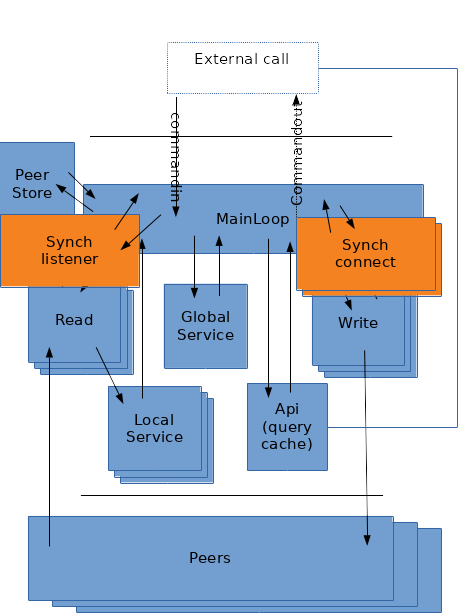

# Hybrid blocking and non blocking transport

In last blog, MyDHT was redesign to include a main event loop (using mio) in a central mainloop process.

The mainloop polled, connection incomming, read and write stream availability.

Also in this mainloop is a slab containing all open stream with their states and pending messages.

Connection being asynch, they are called directly from the mainloop, and read/write stream listen/write in a suspendable service (suspending on WouldBlock error through ReadYield and WriteYield stream composition).

Service abstraction means that it can be (depending on mydht conf inner traits) into a suspendable thread, into a coroutine, into a local function call (in fact for read and write it cannot eg in previous blog)...

So all is fine, yet I got this nice (not so nice in fact) test transport implementation from when mydht ran with blocking transport and all my testcase with it are broken. Fine but what if I want to fast design a transport or use a transport that do not implement non blocking primitive.  
Easy just implement a composition transport (adapter) containing the blocking transport and changing it to non blocking (the inverse of what I did in previous mydht implementation for mio tcp), just running every stream in their trait and when a reply occurs trigger a registration to mio loop letting mydht read from the share buffer.  
Wait, it means that I need to thread (I can use service internally) over reader, over connection listener this generic transport implementation, shared their read result with the read service in other thread (shared mem or message), transmit asynch mydht connection to this transport and register on connect (plus send synch stream to composing stream).  
Doable, yet duplicating read service felt wrong (read service from adapter and read service linked to mio loop), especially since the transport one must run in a thread and the loop one may require a thread (if local service is heavy or if deserializing is seen as costy eg if writing attachment in a file).

So idea may simply be to make transport abstraction compatible with both paradigm, and mydht able to run with both.

# Transport traits

## Transport

```rust
pub trait Transport : Send + Sync + 'static + Registerable {
  type ReadStream : ReadTransportStream;
  type WriteStream : WriteTransportStream;
  type Address : Address;
  fn accept(&self) -> Result<(Self::ReadStream, Option<Self::WriteStream>)>;
  fn connectwith(&self, &Self::Address) -> IoResult<(Self::WriteStream, Option<Self::ReadStream>)>;
  fn disconnect(&self, &Self::Address) -> IoResult<bool> { Ok(false) }
}
```
Transport is managing readwrite stream, being both a connection listener (fn accept) and a the way to connect to (fn connectwith).

Disconnect method is currently unused and should be remove (remnant of old design where transport was able to spawn read service).  
Synch constraint is also a remnant and is useless in mainloop approach, yet with next Synch transport thread it is still needed : for synch transport I think we should run a mutex adapter for it (we already did it with an Arc in this case).  
Send constraint could be remove and switch to a service spawner SRef or Send constraint.  

The 'accept' and 'connectwith' returns a single stream or both read and write stream, it depends on transport implementation : for instance with tcp we generally will use the same socket and both will be return, for other context we may have unidirectional handle (for instance a transport using a route that change with every calls in an non authenticated mydht).

## Registration

```rust
pub trait Registerable {
  fn register(&self, &Poll, Token, Ready, PollOpt) -> Result<bool>;
  fn reregister(&self, &Poll, Token, Ready, PollOpt) -> Result<bool>;
}
```
This trait allows registration on mio loop (basically same as mio register), the interesting point is that it is not mandatory, and returning 'Ok(false)' will indicate that we did not register and that synch mechanism are needed.


## Streams

Streams trait are not really asynch they simply (cf tcp c primitive) return a WouldBlock error when not available (true also for previous tarnsport connect and accept).
```rust
pub trait ReadTransportStream : Send + Read + 'static + Registerable {
  fn disconnect(&mut self) -> Result<()>;

```
```rust
pub trait WriteTransportStream : Send + Write + 'static + Registerable {
  fn disconnect(&mut self) -> Result<()>;

```

What is relevant here are Registerable constraint (optional mio registration) and Read/Write one, meaning that we use Blocking IO abstraction (and we error WouldBlock when asynch).

# Blocking transport changes




So new threads are used to manage connection, the synch with mainloop is done with message.

## Connection listener

When running mydht with test case, nothing ran : connection in mainloop simply never listen for connection since transport is not registered and call to accept is never done (it is normally done when event is returned by mainloop).

So we create a 'SynchConnectService' that is launch when registration of transport returns false (in 'init_state' of MyDHTConf). When configuring MyDHTConf with a synch transport, 'NoSpawn' can simply be use as its spawner but anyway it will not be spawn.  

The service implementation is really straight forward :
```rust
impl<T : Transport> Service for SynchConnListener<T> {
  type CommandIn = SynchConnListenerCommandIn;
  type CommandOut = SynchConnListenerCommandOut<T>;

  fn call<S : SpawnerYield>(&mut self, _req: Self::CommandIn, _async_yield : &mut S) -> Result<Self::CommandOut> {
    match self.0.accept() {
      Ok((rs,ows)) => {
        return Ok(SynchConnListenerCommandOut::Connected(rs,ows));
      },
      // ignore error
      Err(e) => error!("Transport accept error : {}",e),
    }
    Ok(SynchConnListenerCommandOut::Skip)
  }
}

```

Result of connection is send back to MainLoop through standard mainloop command (channel reception being registered on loop).

```rust
impl<MC : MyDHTConf> SpawnSend<SynchConnListenerCommandOut<MC::Transport>> for SynchConnListenerCommandDest<MC> {
  const CAN_SEND : bool = true;
  fn send(&mut self, r : SynchConnListenerCommandOut<MC::Transport>) -> Result<()> {
    match r {
      SynchConnListenerCommandOut::Connected(rs,ows) => {
        self.0.send(MainLoopCommand::ConnectedR(rs,ows))?;
      },
      SynchConnListenerCommandOut::Skip => (),
    };
    Ok(())
  }
}
```

As with ReadService for blocking transport, this service required to run on a **separate thread from MainLoop thread**, because it will block without yielding/suspending.

The new 'MainLoopCommand::ConnectedR' do a similar job as when accept is called in mainloop.

## Connecting with other peer

Connection listener was not enough : 'connectwith' method from transport is now taking time and would block up to possible timeout if there is no peer at the other side. So we need to run connect in another service (currently done in mainloop) : for this we run a pseudo-pool of service (on paper pooling should be done in the service spawner implementation but this is a cheap compromise) running connection.

Similarily to connection listener, we use a message to send back connection to MainLoop.

The service is as staight forward as for the listener.

```rust
impl<T : Transport> Service for SynchConnect<T> {
  type CommandIn = SynchConnectCommandIn<T>;
  type CommandOut = SynchConnectCommandOut<T>;

  fn call<S : SpawnerYield>(&mut self, req: Self::CommandIn, _async_yield : &mut S) -> Result<Self::CommandOut> {
    let SynchConnectCommandIn(slab_ix,add) = req;
    Ok(match self.0.connectwith(&add) {
      Ok((ws,ors)) => SynchConnectCommandOut::Connected(slab_ix,ws,ors),
      Err(e) => {
        debug!("Could not connect: {}",e);
        SynchConnectCommandOut::Failure(slab_ix)
      },
    })
  }
}
```
Except that on error a failure message is send : this allows the mainloop to get rid of initial slab cache (a variant of standard unconnected slab cache which bufferised message until connection is done but obviously without the Write stream) : 
```rust
pub enum SlabEntryState<T : Transport, RR, WR, WB,P> 
{
...
  WriteStream(T::WriteStream,WB),
  WriteConnectSynch(WB),
...
}
```

So when connecting with another peer, we check if the transport was asynch, if it was we initialize cache and spawn or use one of the connection service. That is the same as with non blocking transport without the connection and stream storage in cache.

The new 'MainLoopCommand::ConnectedW' do a similar job as when transport Write become ready for the first time (switch slab state and spawn write service) except that it may also initialize read stream when in message (that is done imediatly after connect for asynch with a different state).


## Read and Write Stream


For read and write stream using a blocking transport seems easier as we simply need not to yield (WouldBlock error is never returned) which is fine, except if reading on same thread as mainloop.
So running it with current implementation only involves some dead code (service suspend on wouldblock and resume on event triggering), and the need for a conditional registration (which is ok with Registrable trait).

It also means that we put our read/write service handle in slabcache and use a peer cache in mainloop (peer in peer cache have reference for slabcache and handle in slabcache have reference of peer), that is related with token registration with asynch transport. For blocking non registrable transport, a simple peer cache containing both peer and read/write service handle could be used (similar to previous mydht design), this is not done and will not (maintanability), so the slabcache is use even if useless in this config.

A trait marker could be use indicating a transport stream is non blocking, then having spawner reference the transport and have this trait constraint for it (similar to what we have with 'ServiceRestartable' marker.
Yet there is currently no usage of transport by the spawner so I do not force this constraint and **synch transport with non threaded service will block silently on reading**.
There may be some cool design where we include in spawner abstraction a reference to component that may yield (transport having no sense for service abstraction), but the service abstraction seem to need simplification at the time.

In the future it will be nice to remove Send and Clone constraint (make it SRef or Send (or dirty dummy panicking/unreachable SRef if non blocking and same thread)) in mydht constraint), and also to change '&self' reference to '&mut self' making homemade transport implementing easier : that is possible with this new design where transport stream is only in mainloop or in service at the same time (no more Arc<TransportStream>).

In fact some variation are present when register return false on those stream :
  - for read, if not registered the service is started immediatly, if registered the stream is put in slab cache until first ready event and then started
  - for write the initial state connection in slab is set to connected and incomming write message will spawn write service (with asynch mode it is put in buffer (the channelin) until write first ready event occurs).


# Conclusion

In fact the idea to run both kind of transport was here from the begining but the need to have process for connect synch was totally overseen.

The implementation is far from ideal due to :
        - connect service pseudo-pool : in previous mydht implementation we connected from Write thread, here we don't, but we can notice that in an eventual transport redesign (change ref to mut ref for easiest homemade transport implementing) that is required.
        - transport is not anymore only use by MainLoop but also by the connect pool and the connection listener thread, this makes it more difficult to change its trait (cf mutex remark).
        - mainloop little overhead in cache

But it still pretty cool.


